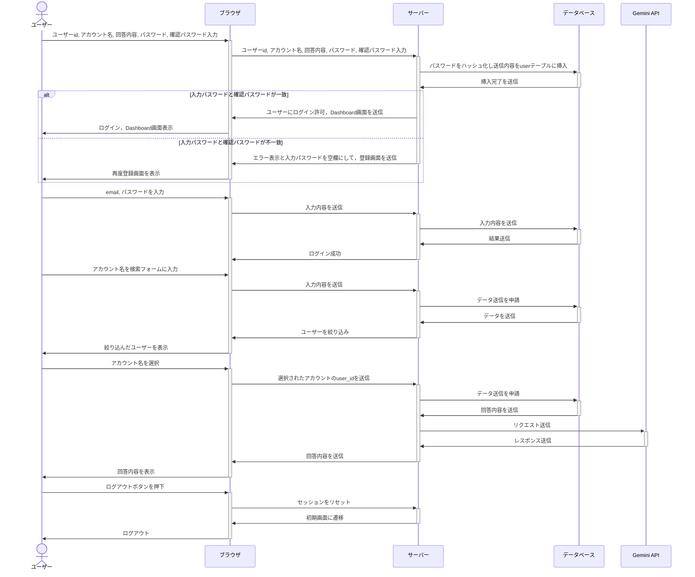

```mermaid
sequenceDiagram
    actor ユーザー
    participant ブラウザ
    participant サーバー
    participant データベース
    participant Gemini API
    ユーザー->>+ブラウザ: ユーザーid, アカウント名, 回答内容, パスワード, 確認パスワード入力
    ブラウザ->>+サーバー: ユーザーid, アカウント名, 回答内容, パスワード, 確認パスワード入力
    サーバー->>+データベース:パスワードをハッシュ化し送信内容をuserテーブルに挿入
    データベース->>-サーバー:挿入完了を送信
    alt 入力パスワードと確認パスワードが一致
        サーバー->>ブラウザ: ユーザーにログイン許可，Dashboard画面を送信
        ブラウザ->>ユーザー: ログイン，Dashboard画面表示
    else 入力パスワードと確認パスワードが不一致
        サーバー->>-ブラウザ: エラー表示と入力パスワードを空欄にして，登録画面を送信
        ブラウザ->>-ユーザー: 再度登録画面を表示
    end

    ユーザー->>+ブラウザ: email, パスワードを入力
    ブラウザ->>+サーバー: 入力内容を送信
    サーバー->>+データベース: 入力内容を送信
    データベース->>-サーバー: 結果送信
    サーバー->>-ブラウザ: ログイン成功

    ユーザー->>ブラウザ: アカウント名を検索フォームに入力
    ブラウザ->>+サーバー: 入力内容を送信
    サーバー->>+データベース: データ送信を申請
    データベース->>-サーバー: データを送信
    サーバー->>-ブラウザ: ユーザーを絞り込み
    ブラウザ->>-ユーザー: 絞り込んだユーザーを表示

    ユーザー->>+ブラウザ: アカウント名を選択
    ブラウザ->>+サーバー: 選択されたアカウントのuser_idを送信
    サーバー->>+データベース: データ送信を申請
    データベース->>-サーバー: 回答内容を送信
    サーバー->>+Gemini API: リクエスト送信
    Gemini API->>-サーバー: レスポンス送信
    サーバー->>-ブラウザ: 回答内容を送信
    ブラウザ->>-ユーザー: 回答内容を表示

    ユーザー->>+ブラウザ: ログアウトボタンを押下
    ブラウザ->>+サーバー: セッションをリセット
    サーバー->>-ブラウザ: 初期画面に遷移
    ブラウザ->>-ユーザー: ログアウト
```
