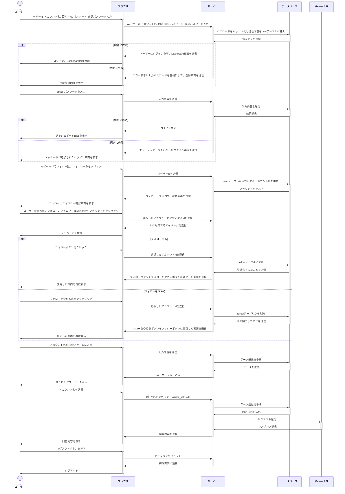

# Talk Deck

このアプリケーションは，初対面の相手とうまく会話をするために利用するものです．相手のアカウントにある情報と自分のアカウントにある情報をもとにして Gemini が質問を考えてくれます．

## メンバー

- 池田 陽人
- 栫 大耀
- 當山 史華
- 平野 健汰

## 機能

- ユーザー登録，ログイン・ログアウト機能
- アカウント検索機能
- トークデッキ表示機能
- フォロー機能

## 使用技術

- Laravel Sail
- MySQL
- Gemini API

## 使い方

1. ログインする(ユーザー登録する)
2. ユーザー検索を行う(相手のアカウント名を聞く)
3. 選択するボタンを押す
4. トークデッキができるので相手との会話をする

## シーケンス図

